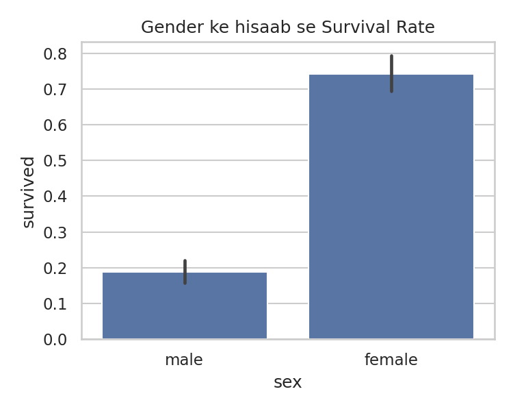
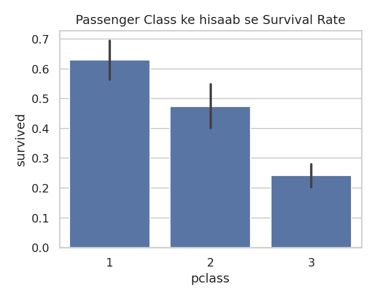
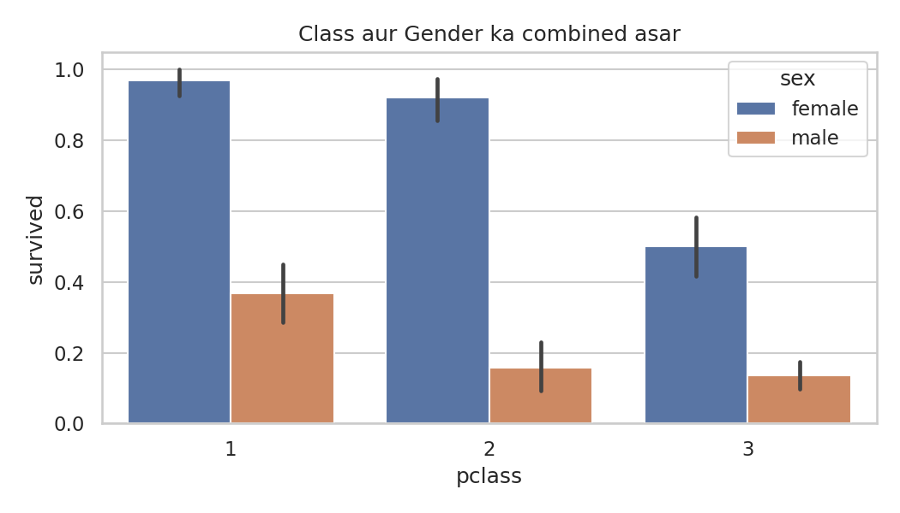
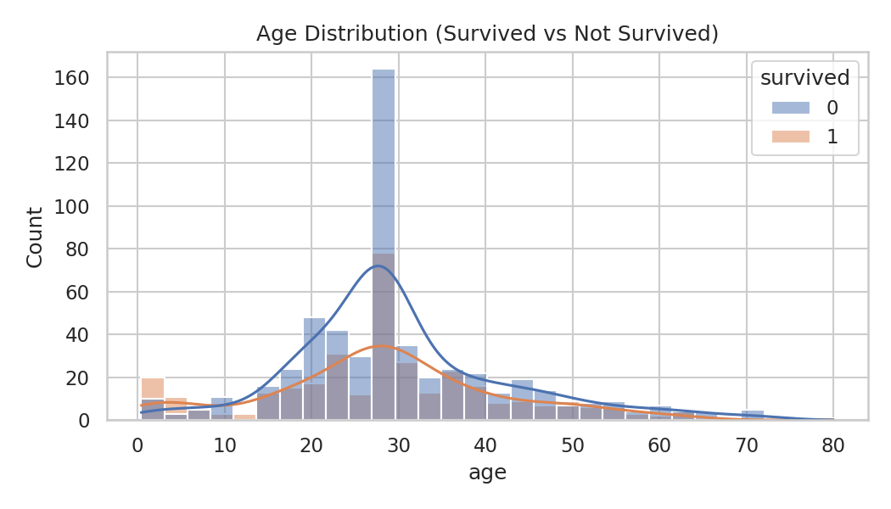
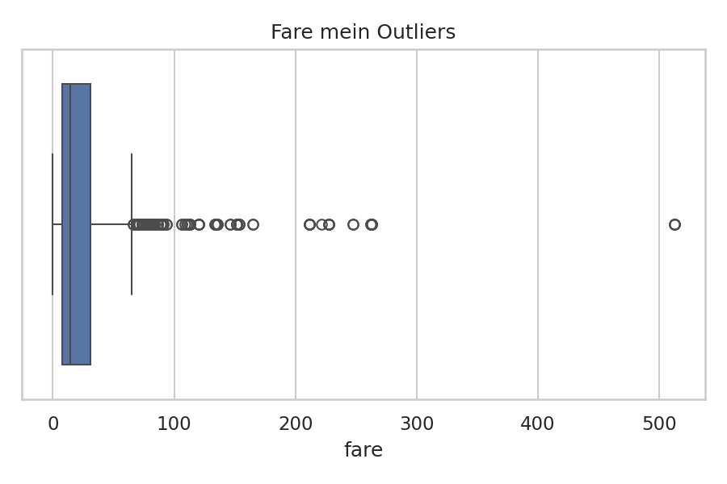
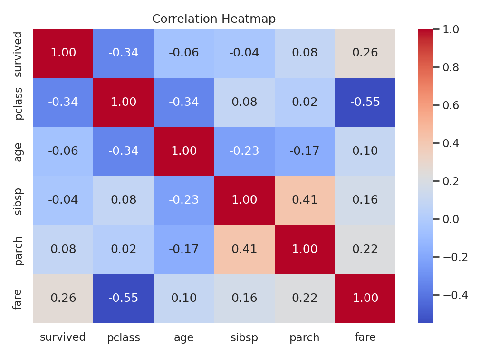

# Titanic EDA - CodeAlpha Internship (Task 2)

Exploratory Data Analysis on the Titanic dataset as part of the CodeAlpha Data Analytics Internship.

## Objective
To understand which factors influenced the survival of Titanic passengers.

## Questions Explored
1. Did gender affect the chances of survival?
2. Did passenger class (1st, 2nd, 3rd) matter?
3. Is there a relationship between age and survival?
4. Did passengers who paid a higher fare survive more often?

## Dataset
- Titanic dataset (loaded via seaborn)
- 891 passengers, 15 columns

## Data Cleaning
| Column | Missing Values | Action |
|---|---|---|
| age | 177 (~20%) | Filled with median |
| deck | 688 (~77%) | Column dropped |
| embarked | 2 | Filled with mode |

Outliers in `fare` were checked using the IQR method (about 13% of rows).

## Key Findings
- **Overall survival rate:** 38.4%
- **Gender:** Females survived at ~74% versus ~19% for males.
- **Class:** 1st class ~63%, 2nd class ~47%, 3rd class ~24%.
- **Fare:** Survivors paid a significantly higher average fare (t-test, p < 0.05).
- **Statistical test:** A chi-square test confirmed a significant relationship between gender and survival (p < 0.05).

## Visualizations

### Survival by Gender

### Survival by Class

### Class and Gender Combined

### Age Distribution

### Fare Outliers

### Correlation Heatmap

## Tools Used
Python, Pandas, NumPy, Matplotlib, Seaborn, SciPy, Google Colab

## Limitations
- Filling
